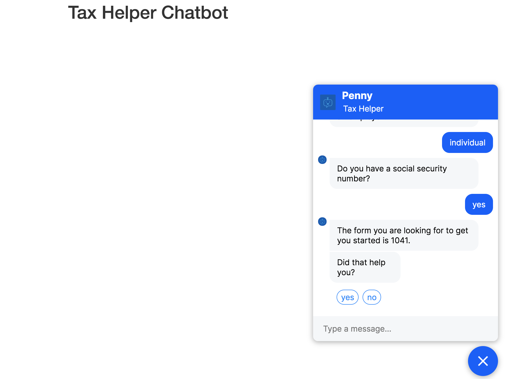

## Welcome to the Tax-Chatbot helper project.

### This project uses the Rasa framework to build a chatbot that answers general inquiries from clients on tax forms. 
#### Note: All data that was used for this chatbot is publicly available at irs.gov.

#### For the app to work, you will need to have Rasa and Flask installed. Before running Rasa, make sure that you have a trained model based on configurations already in the code. Please see Rasa to get started here: https://rasa.com/docs/getting-started/

